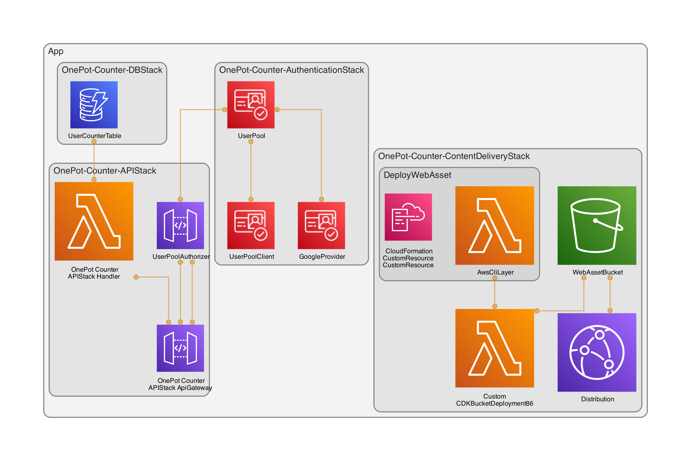

# OnePot Counter

Welcome to the OnePot Counter project! This web application exemplifies the integration of React with AWS services using the Cloud Development Kit (CDK). Designed as an intuitive starting point, it demonstrates best practices in setup and configuration, ideal for similar future projects.

## Live Demo

Explore the live version of OnePot Counter [here](https://d252xm6a9k7j8o.cloudfront.net/).

## Getting Started

To set up and deploy OnePot Counter, follow these steps:

### Google OAuth Setup

1. Create a Google Cloud Project:
    - Go to the [Google Cloud Console](https://console.cloud.google.com).
    - Create a new project or select an existing one.
2. Set Up OAuth Credentials:
    - Navigate to the "Credentials" page in the "APIs & Services" section.
    - Click "Create credentials" and select "OAuth client ID".
    - Configure the OAuth consent screen if prompted.
    - For the application type, choose "Web application".
    - Add authorized redirect URIs (e.g., https://<your-cognito-domain>/oauth2/idpresponse). These should match the URIs configured in your Cognito User Pool.
    - Note down the generated "Client ID" and "Client secret".
3. Update `cdk.json` with Google Client ID:
    - In your project's `cdk.json` file, add a context key for `googleClientId` with the value of the Google Client ID:
    ```json
    {
        "context": {
            "googleClientId": "your-google-client-id"
        }
    }
    ```
4. Store Google Client Secret in AWS Secrets Manager:
    - Store the Google Client Secret in AWS Secrets Manager:
    ```sh
    aws secretsmanager create-secret --name onepot-counter-google-client-secret --secret-string "<YOUR_GOOGLE_CLIENT_SECRET>"
    ```
    - Ensure your AWS credentials have the necessary permissions to interact with Secrets Manager.

### Setting Up and Deploying with AWS CDK

1. Set Environment Variables for CDK:
    - Define AWS account and credentials to guide the CDK CLI:
    ```sh
    # Define AWS account and credentials for CDK
    export CDK_DEFAULT_ACCOUNT="123456781234"
    export AWS_ACCESS_KEY_ID="[Your_Access_Key_ID]"
    export AWS_SECRET_ACCESS_KEY="[Your_Secret_Access_Key]"
    ```
2. Bootstrap AWS account for CDK
    - Prepare your AWS account for CDK deployment
    ```
    npm run cdk:bootstrap
    ```
3. Deploy the Application
    - Deploy OnePot Counter to your AWS account
    ```
    npm run cdk:deploy
    ```

### Accessing the Application

After deployment, you can access the OnePot Counter application at the URL provided by the CloudFront distribution.

## Technology Stack

This project demonstrates a streamlined integration of key technologies:

-   **React**: For building the user interface.
-   **React Scripts**: Simplifies setup and workflow as part of the create-react-app toolkit.
-   **TypeScript**: Adds static typing to JavaScript for improved code quality.
-   **Tailwind CSS**: A utility-first CSS framework for efficient and responsive design.
-   **AWS Cloud Development Kit (CDK)**: Facilitates cloud infrastructure management with code-defined resources and deployment.
-   **ESBuild**: A fast bundler and minifier, used for efficiently bundling Lambda handlers, enhancing deployment speed.

## CDK Stacks



The project is structured into four distinct CDK stacks:

1. **Frontend Hosting Stack**
    - **Purpose**: Manages resources for hosting and serving the web application's frontend assets.
    - **Resources**:
        - **CloudFront Distribution**: Serves content from the S3 bucket.
        - **S3 Bucket**: Stores web assets.
2. **API Stack**
    - **Purpose**: Handles backend API infrastructure.
    - **Resources**:
        - **API Gateway**: Manages and routes API requests.
        - **Lambda Functions**: Backend logic triggered by API Gateway.
3. **Data Persistence Stack**
    - **Purpose**: Manages data storage.
    - **Resources**:
        - **DynamoDB Table**: Stores the counter data.
4. **Authentication Stack**
    - **Purpose**: Manages user authentication and authorization.
    - **Resources**:
        - **Cognito User Pool**: Configured with Google as an identity provider.

## File Naming Conventions

-   **React Files**: Use PascalCase (e.g. `MyComponent.jsx`) for React component files
-   **CSS, HTML and Assets**: Stick to kebab-case (e.g., `main-style.css`, `index.html`) for stylesheets, HTML documents, and asset files.
-   **CDK Files**: Follow kebab-case (e.g., cdk-stack.ts). This aligns with the default naming convention used by the [`cdk init`](https://github.com/aws/aws-cdk/blob/main/packages/aws-cdk/README.md) command.
-   **Lambda Handler Files**: Employ camelCase (e.g., handleRequest.js) for Lambda function handlers.
